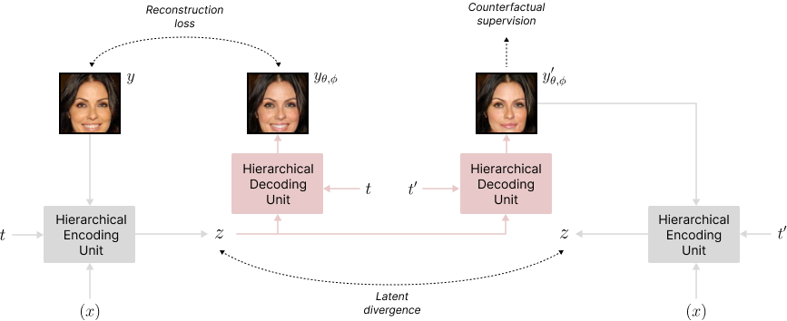

# Variational Causal Inference

This repository is the official implementation of [**Variational Causal Inference**](https://arxiv.org/abs/2410.12730).



```BiBTeX
@article{wu2024counterfactual,
  title={Counterfactual Generative Modeling with Variational Causal Inference},
  author={Wu, Yulun and McConnell, Louie and Iriondo, Claudia},
  journal={International Conference on Learning Representations},
  year={2025}
}
```


## Installation

### 1. Create Conda Environment
```bash
conda config --append channels conda-forge
conda create -n vci-env python=3.9
conda activate vci-env
pip install -r requirements.txt
```

### 2. Install Learning Libraries
- [Pytorch](https://pytorch.org/) [**1.13**.1](https://pytorch.org/get-started/previous-versions/)

  \* *make sure to install the right versions for your toolkit*


## Data

Visit our [resource site](https://osf.io/q6tpk/) to download the datasets.

### Single-cell Perturbation Dataset
Download the contents of `cell/` into [datasets](datasets). To see how to process your own dataset, download the contents of `raw/` into [datasets](datasets) and follow the examples. A clean example of data preparation can be found in [SciplexPrep.ipynb](datasets/SciplexPrep.ipynb). For an example of data preparation on a messier dataset with thorough analysis and visualizations, see [MarsonPrep.ipynb](datasets/MarsonPrep.ipynb).

In summary, the preparation procedure includes:

-   Quality Control

-   Normalization

-   Gene Selection

-   Field Specification

-   (Optional) Dataset Split

-   (Optional) Out-of-distribution Selection

-   (Optional) Differentially-expressed Gene Ranking


## Run
Once the environment is set up and the data are prepared, the function call to train the model is:

```bash
./run-gene.sh &
```

```bash
./run-celebA.sh &
```

```bash
./run-morphoMNIST.sh &
```

A list of flags may be found in these run files and `main.py` for experimentation with different network parameters. The run log and models are saved under `*artifact_path*/saves`, and the tensorboard log is saved under `*artifact_path*/runs`.


## Adaptation

The VCI framework is about the innovation of training loss and propagation workflow, and not about a specific model architecture. Hence, practitioners are free to use the latest development in vision models, for example, or any model architecture of their liking by simply replacing encoder $q_\phi$ in the [encoder constructor](https://github.com/yulun-rayn/variational-causal-inference/blob/8c3ca43d9dfdbe20d0515622fafe35bf88f71359/vci/model/model.py#L781) and decoder $p_\theta$ in the [decoder constructor](https://github.com/yulun-rayn/variational-causal-inference/blob/8c3ca43d9dfdbe20d0515622fafe35bf88f71359/vci/model/model.py#L805) with the desired models. Note that if the desired models have different output format, other class methods might also need to be updated. For example, our [hierarchical models](vci/model/hierarchy.py) return a tuple instead of a tensor, and several methods are adapted accordingly in the [corresponding wrapper](https://github.com/yulun-rayn/variational-causal-inference/blob/8c3ca43d9dfdbe20d0515622fafe35bf88f71359/vci/model/model.py#L833).

Alternatively, if researchers would like to incorporate our training loss and propagation workflow into their own codebase, they can do so by simply adapting the [loss method](https://github.com/yulun-rayn/variational-causal-inference/blob/65a1f80b69916d2de54bc2a98162cb5adbbf94ff/vci/model/model.py#L534) and the [forward method](https://github.com/yulun-rayn/variational-causal-inference/blob/65a1f80b69916d2de54bc2a98162cb5adbbf94ff/vci/model/model.py#L462) into their own module.


## License

Contributions are welcome! All content here is licensed under the MIT license.
